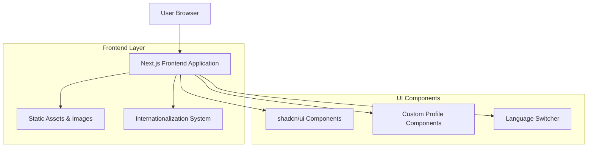
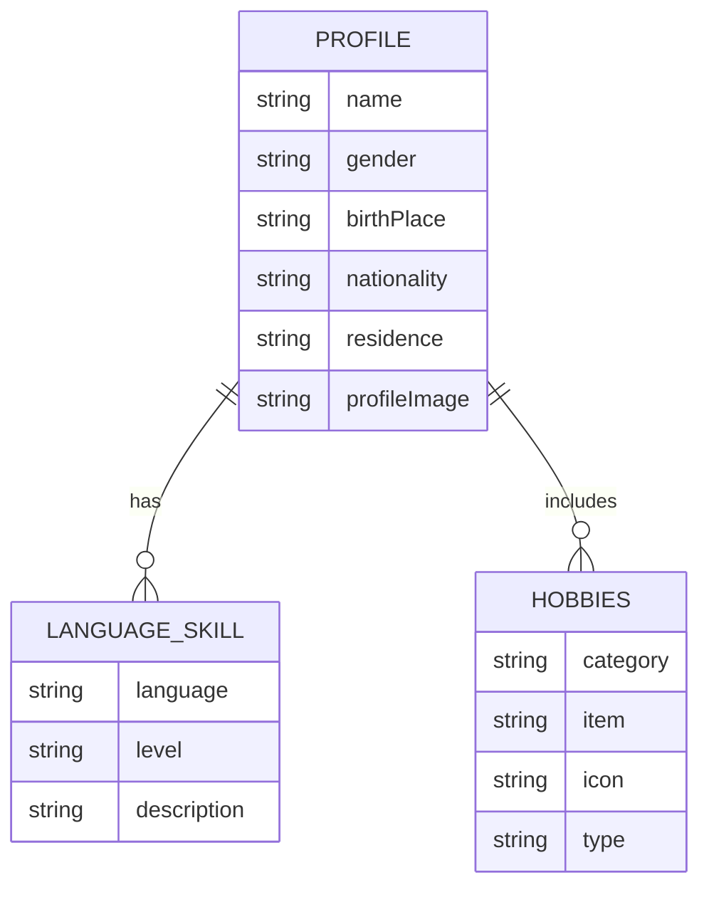

# チンウケイ個人紹介ウェブサイト - 技術アーキテクチャ文書

## 1. Architecture design



## 2. Technology Description

- Frontend: Next.js@14 + React@18 + TypeScript + Tailwind CSS@3 + shadcn/ui + next-intl + Framer Motion
- Backend: None (静的サイト生成)

## 3. Route definitions

| Route             | Purpose                                            |
| ----------------- | -------------------------------------------------- |
| /[locale]         | 多言語対応のルートレイアウト（ja, en, zh）         |
| /[locale]/        | ホームページ、プロフィール概要とヒーローセクション |
| /[locale]/profile | 詳細プロフィールページ、基本情報と言語スキル       |
| /[locale]/hobbies | 趣味・嗜好ページ、好きなもの・嫌いなものの詳細     |

## 4. API definitions

本プロジェクトは静的サイトのため、外部 API は使用しません。すべてのデータは静的な JSON ファイルまたは TypeScript 定数として管理されます。

### 4.1 データ型定義

```typescript
// プロフィール情報の型定義
interface ProfileData {
  name: string;
  gender: string;
  birthPlace: string;
  nationality: string;
  residence: string;
  languages: LanguageSkill[];
  profileImage: string;
}

interface LanguageSkill {
  language: string;
  level: string;
  description?: string;
}

// 趣味・嗜好情報の型定義
interface HobbiesData {
  favorites: FavoriteItem[];
  skills: string[];
  hobbies: string[];
  dislikes: string[];
}

interface FavoriteItem {
  category: string;
  item: string;
  icon?: string;
}
```

## 5. Data model

### 5.1 Data model definition



### 5.2 Data Definition Language

静的サイトのため、データベースは使用しません。代わりに以下の JSON ファイル構造でデータを管理します：

```typescript
// data/profile.ts
export const profileData: Record<string, ProfileData> = {
  ja: {
    name: "チンウケイ",
    gender: "女性",
    birthPlace: "上海",
    nationality: "中国",
    residence: "神保町",
    languages: [
      { language: "中国語", level: "ネイティブ" },
      { language: "日本語", level: "流暢" },
      { language: "英語", level: "中級" },
      { language: "フランス語", level: "挨拶程度", description: "挨拶" },
      { language: "韓国語", level: "初級", description: "悪口" },
    ],
    profileImage: "/images/profile-placeholder.jpg",
  },
  en: {
    name: "Chen Yuxin",
    gender: "Female",
    birthPlace: "Shanghai",
    nationality: "Chinese",
    residence: "Jimbocho",
    languages: [
      { language: "Chinese", level: "Native" },
      { language: "Japanese", level: "Fluent" },
      { language: "English", level: "Intermediate" },
      { language: "French", level: "Beginner", description: "Greetings" },
      { language: "Korean", level: "Beginner", description: "Swear words" },
    ],
    profileImage: "/images/profile-placeholder.jpg",
  },
  zh: {
    name: "陈羽馨",
    gender: "女性",
    birthPlace: "上海",
    nationality: "中国",
    residence: "神保町",
    languages: [
      { language: "中文", level: "母语" },
      { language: "日语", level: "流利" },
      { language: "英语", level: "中级" },
      { language: "法语", level: "初级", description: "问候" },
      { language: "韩语", level: "初级", description: "骂人" },
    ],
    profileImage: "/images/profile-placeholder.jpg",
  },
};

// data/hobbies.ts
export const hobbiesData: Record<string, HobbiesData> = {
  ja: {
    favorites: [
      { category: "食べ物", item: "グミ", icon: "🍬" },
      { category: "電車", item: "半蔵門線", icon: "🚇" },
      { category: "先生", item: "竹内先生", icon: "👨‍🏫" },
      { category: "お菓子", item: "きゅうりのチップス", icon: "🥒" },
      { category: "色", item: "ピンク", icon: "🩷" },
      { category: "動物", item: "小魚と七七", icon: "🐠" },
      { category: "スポーツ", item: "水泳", icon: "🏊‍♀️" },
      { category: "場所", item: "北海道", icon: "🗾" },
      { category: "お酒", item: "ラム", icon: "🥃" },
      { category: "曜日", item: "日曜日", icon: "📅" },
    ],
    skills: ["めっちゃ可愛い"],
    hobbies: ["テレビ見る"],
    dislikes: ["蚊"],
  },
  // en, zh versions...
};
```
