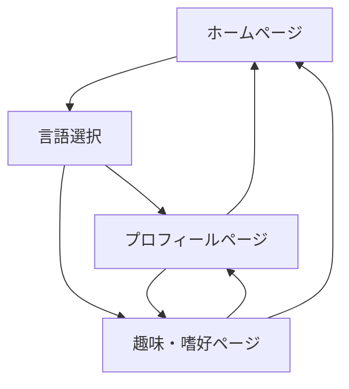

# チンウケイ個人紹介ウェブサイト - 製品要件書

## 1. Product Overview

チンウケイさんの個人紹介を目的とした、メルヘンで可愛らしいデザインの多言語対応ウェブサイトです。

- Next.js App Router + shadcn/ui を使用し、日本語・英語・中国語の 3 言語に対応したレスポンシブな個人プロフィールサイトを構築します。
- 趣味や嗜好を親しみやすく紹介し、訪問者との親近感を醸成することを目的としています。

## 2. Core Features

### 2.1 User Roles

本サイトは情報閲覧型のため、特別な役割区分は設けません。すべての訪問者が同等にコンテンツを閲覧できます。

### 2.2 Feature Module

本サイトは以下の主要ページで構成されます：

1. **ホームページ**: ヒーローセクション、言語切り替えナビゲーション、プロフィール概要
2. **プロフィールページ**: 基本情報、顔写真、使用可能言語の詳細表示
3. **趣味・嗜好ページ**: 好きなもの・嫌いなものの詳細な紹介セクション

### 2.3 Page Details

| Page Name          | Module Name                | Feature description                                                                |
| ------------------ | -------------------------- | ---------------------------------------------------------------------------------- |
| ホームページ       | ヒーローセクション         | チンウケイさんの写真とキャッチフレーズを表示、アニメーション効果付き               |
| ホームページ       | 言語切り替えナビゲーション | 日本語・英語・中国語の切り替えボタン、現在の言語をハイライト表示                   |
| ホームページ       | プロフィール概要           | 名前、出身地、居住地などの基本情報をカード形式で表示                               |
| プロフィールページ | 基本情報セクション         | 名前、性別、出身地、国籍、居住地を整理して表示                                     |
| プロフィールページ | 顔写真表示                 | ダミー画像を使用、将来的にアップロード機能対応予定                                 |
| プロフィールページ | 言語スキル表示             | 使用可能言語（中国語、日本語、英語、フランス語、韓国語）をレベル別に表示           |
| 趣味・嗜好ページ   | 好きなものセクション       | 食べ物、電車、先生、お菓子、色、動物、スポーツ、場所、お酒、曜日をカテゴリ別に表示 |
| 趣味・嗜好ページ   | 特技・趣味セクション       | 特技（めっちゃ可愛い）と趣味（テレビ見る）を強調表示                               |
| 趣味・嗜好ページ   | 嫌いなものセクション       | 嫌いなもの（蚊）をユーモラスに表示                                                 |

## 3. Core Process

**訪問者の基本フロー:**

1. ホームページにアクセス
2. 言語を選択（日本語/英語/中国語）
3. プロフィール情報を閲覧
4. 趣味・嗜好ページで詳細な個人情報を確認
5. 各ページ間を自由にナビゲーション

## 4. User Interface Design

### 4.1 Design Style

- **プライマリカラー**: ピンク系（#FF69B4, #FFB6C1, #FFC0CB）
- **セカンダリカラー**: 白、薄紫、薄い黄色
- **ボタンスタイル**: 丸みを帯びた 3D ボタン、ホバー時にふわっと浮き上がるアニメーション
- **フォント**: 日本語：Noto Sans JP、英語：Inter、中国語：Noto Sans SC、サイズ：16px-24px
- **レイアウトスタイル**: カードベースレイアウト、上部固定ナビゲーション
- **アイコンスタイル**: 可愛らしい絵文字と Lucide React アイコンを組み合わせ

### 4.2 Page Design Overview

| Page Name          | Module Name                | UI Elements                                                                  |
| ------------------ | -------------------------- | ---------------------------------------------------------------------------- |
| ホームページ       | ヒーローセクション         | 大きな円形プロフィール画像、グラデーション背景、浮遊するハートアニメーション |
| ホームページ       | 言語切り替えナビゲーション | 右上固定、国旗アイコン付きドロップダウンメニュー、スムーズなトランジション   |
| プロフィールページ | 基本情報セクション         | 情報カード、アイコン付きリスト、ソフトシャドウ効果                           |
| 趣味・嗜好ページ   | 好きなものセクション       | グリッドレイアウト、各項目にホバーエフェクト、カテゴリ別カラーコーディング   |

### 4.3 Responsiveness

モバイルファーストのレスポンシブデザインを採用し、タッチ操作に最適化されたインタラクションを提供します。ブレークポイント：sm(640px)、md(768px)、lg(1024px)、xl(1280px)で最適化します。
